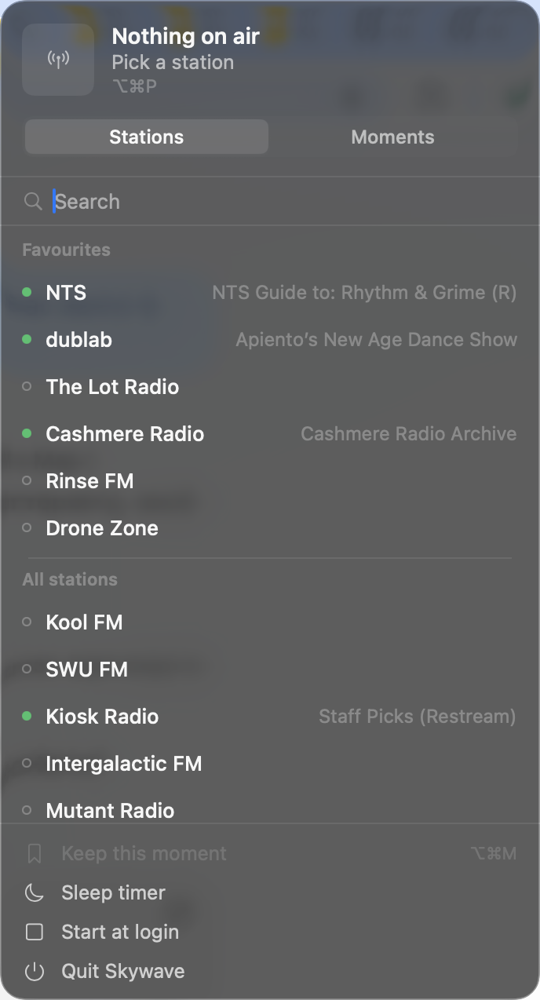
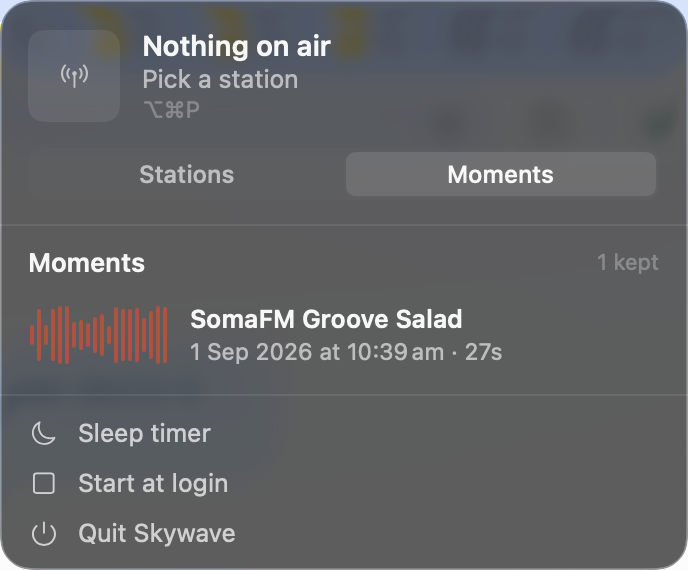

# Skywave

A macOS menubar player for twenty independent internet radio stations — NTS, dublab, Rinse, Kiosk, WFMU and the rest — in one panel, with what's on air next to each name. No window, no account, live only.

<p align="center">
  
</p>

## Why

Each of these stations has its own site, its own player and its own API. Switching between them means twenty tabs. Skywave puts them behind one icon and asks each station's API what it is broadcasting, so choosing a station means choosing a show, not a name.

The panel is the whole product. It stays out of the Dock and out of ⌘-Tab; everything works from the keyboard.

## What it does

- **Twenty stations, one list.** Favourites first. Eight stations report their current show through an API; those lines update while the panel is open.
- **Moments.** The last sixty seconds of whatever is playing are always on hand. `⌥⌘M` from any app saves them to `~/Music/Skywave` as an untouched copy of the broadcast — no re-encoding.
- **Stays on.** Reconnects after sleep, after the network drops, after a stall. A station that stops answering is marked *not responding* with the last time it was heard, instead of pretending to reconnect forever.
- **Fits the system.** Media keys, the Now Playing card, a global play/pause key, start at login, a sleep timer that fades out, and a notification when the show changes on the station you're listening to.
- **Even loudness.** Measured across the catalog, the loudest station is 19.5 dB above the quietest. Each carries a gain so switching doesn't jump.

<p align="center">
  
</p>

## Install

Requires macOS 14 or later and the Swift toolchain. Command Line Tools are enough — there is no Xcode project.

```bash
git clone git@github.com:ndmik-dev/skywave.git
cd skywave
./Scripts/bundle.sh --install
```

This builds, assembles `Skywave.app`, installs it to `/Applications` and launches it. Run it again after any change.

## Keys

| Anywhere | |
|---|---|
| `⌥⌘P` | play or pause the current station (or the last one, or the first favourite) |
| `⌥⌘M` | keep the last sixty seconds as a moment |
| media keys | play, pause, and the Now Playing card |

| In the panel | |
|---|---|
| type | search by station, city, or what's on air |
| `↑` `↓` `⏎` | pick a station and play it |
| `Esc` | clear the search, then close the panel |
| `⌘1` `⌘2` | Stations · Moments |
| right-click | add to or remove from favourites |

## Stations

The catalog is [`stations.json`](Sources/SkywaveKit/Resources/stations.json), and it is data rather than code: adding a station is adding an entry.

```json
{
  "id": "dublab",
  "name": "dublab",
  "city": "Los Angeles",
  "stream": "https://dublab.out.airtime.pro/dublab_a",
  "adapter": "airtime",
  "adapterId": "dublab",
  "gain": 0.977,
  "measuredLufs": -15.8,
  "favorite": true,
  "logo": "dublab.png"
}
```

| Field | |
|---|---|
| `stream` | the audio URL — Icecast/Shoutcast over MP3 or AAC, or an HLS playlist |
| `adapter` | how to find out what's on: `airtime`, `radiocult`, `radioco`, `nts`, `icy`, or `hls` |
| `adapterId` | the station's key in that adapter's API; omit for `icy` and `hls` |
| `gain` | applied straight to the player's volume, so it can only turn a station down; stations quieter than the −16 LUFS target stay at `1.0` |
| `logo` | a file in `Resources/Logos`; without one the station gets a lettered tile |

The adapters and what each one can tell you:

| Adapter | Asks | Gives |
|---|---|---|
| `airtime` | `<id>.airtime.pro/api/live-info-v2` | show and track |
| `radiocult` | `api.radiocult.fm/api/station/<id>/schedule/live` | show, or off air |
| `radioco` | `public.radio.co/stations/<id>/status` | current title |
| `nts` | `nts.live/api/v2/live` | show |
| `icy` | nothing — reads the `StreamTitle` the stream itself carries | track, on most stations |
| `hls` | nothing | — |

Favourites are edited in the panel and stored in user defaults, so a catalog update never overwrites them.

## Moments

Skywave keeps a second connection to the station you are playing and holds the last sixty seconds of it as the raw broadcast bytes. Saving writes them to `~/Music/Skywave/<date> — <station> — <show>.mp3` (or `.aac`), byte for byte what the station sent. Moments play in place from the panel, or in anything else that plays audio.

The one HLS station in the catalog, The Lot Radio, is served in segments and cannot be captured.

## From the command line

The installed app doubles as a diagnostic tool. These run the real bundle, with its real entitlements, which is the only way to catch a stream that App Transport Security would block:

```bash
/Applications/Skywave.app/Contents/MacOS/Skywave --check              # the catalog loads
/Applications/Skywave.app/Contents/MacOS/Skywave --play dublab 20     # a station plays, muted
/Applications/Skywave.app/Contents/MacOS/Skywave --moment dublab 25   # a moment is captured and saved
/Applications/Skywave.app/Contents/MacOS/Skywave --played             # days each station has been heard
```

The checks are a plain executable, because XCTest ships with Xcode:

```bash
swift run Checks          # catalog, adapters, text handling, resilience, moments
swift run Checks --live   # also polls every station that has an API
```

`swift run Probe --station nts --minutes 40 --mute` is the endurance test the whole design rests on: forty minutes of an endless Icecast stream through `AVPlayer` without a single stall.

## Limitations

- **Track titles** are absent on Drone Zone, Groove Salad and Operator Radio — the streams don't carry them — and are placeholders on Kool, Rinse and SWU, which the panel filters out.
- **Logos** come from the stations' own websites. Fine for personal use; not fine to redistribute. SWU FM and Radio Alhara have none.
- **The second connection doubles bandwidth** while a station plays. About 2 MB a minute at 256 kbps.
- **The app is ad-hoc signed.** It runs; it cannot be handed to someone else, and it cannot use ShazamKit.

## Layout

```
Sources/
  SkywaveKit/         everything that isn't UI
    Core/             player, recorder, resilience, catalog, moments, play log
    Adapters/         one file per station API, plus ICY and text cleanup
    Resources/        stations.json and Logos/
  Skywave/            the menubar app
    App/              state, headless modes
    UI/               panel, station list, moments list, theme
    System/           hotkeys, media keys, notifications, login item
  Checks/             self-checks (swift run Checks)
  Probe/              the AVPlayer endurance test
Scripts/bundle.sh     builds and installs the .app
```

Decisions, verified facts about every API, and the plan live in [`CLAUDE.md`](CLAUDE.md).
